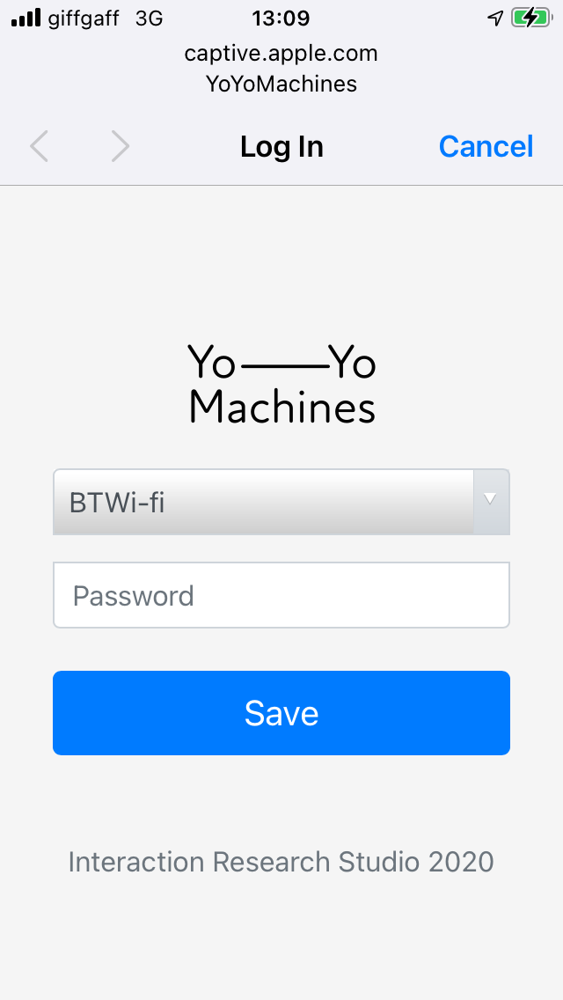

# The Yo-Yo WiFi Manager Library [pre-release]
The Yo-Yo WiFi Manager Library is an [Arduino](http://www.arduino.cc/download) Library for [ESP8266](https://en.wikipedia.org/wiki/ESP8266) and [ESP32](https://en.wikipedia.org/wiki/ESP32) that manages WiFi credentials via a [captive portal](https://en.wikipedia.org/wiki/Captive_portal) configuration webpage; in this respect it is an alternative to the excellent [WiFiManager](https://github.com/tzapu/WiFiManager). However, the Yo-Yo WiFi Manager Library also supports the configuration of multiple devices simultaneously through one portal page, manages multiple sets of network credentials per device and offers full customisation of the portal HTML and JavaScript. 

Beyond WiFi credential management, the Yo-Yo WiFi Manager Library provides a means to host rich web experiences that can integrate with electronics for Physical Computing applications. Hosted webpages using HTML and JavaScript can call custom RESTful endpoints that can easily be defined to talk directly to the ESP modules and any external circuitry. The webserver can serve any [SPIFFS](https://docs.espressif.com/projects/esp-idf/en/latest/esp32/api-reference/storage/spiffs.html) file, be that media files (JPEG, PNG, MP3, etc) or any JavaScript libraries ([jQuery](https://jquery.com/), [bootstrap.js](https://getbootstrap.com/), [Vue.js](https://vuejs.org/), [p5.js](https://p5js.org/), etc) within the storage capacity of the device. Operating as a captive portal and managing its own WiFi network, there is no requirement for an Internet connection. Furthermore, the library will manage local peer networks of multiple devices operating together in this way.

The library is being developed by David Chatting ([@davidchatting](https://github.com/davidchatting)), Mike Vanis ([@mikevanis](https://github.com/mikevanis)) and Andy Sheen ([@andysheen](https://github.com/andysheen)) for the [Yo–Yo Machines](https://www.yoyomachines.io/) project at the [Interaction Research Studio](https://github.com/interactionresearchstudio) - Goldsmiths, University of London. Collaboration welcome - please contribute by raising issues and making pull requests via GitHub.

<iframe width="560" height="315" src="https://www.youtube.com/embed/mcnmPNE4ELA" title="Yo-Yo WiFi Manager P5js example demo" frameborder="0" allow="accelerometer; autoplay; clipboard-write; encrypted-media; gyroscope; picture-in-picture; web-share" allowfullscreen></iframe>

## Installation

~~The latest stable release of the library is available in the Arduino IDE Library Manager - search for "YoYoWiFiManager". Click install.~~

Alternatively, the library can be installed manually. First locate and open the `libraries` directory used by the Arduino IDE, then clone this repository (https://github.com/interactionresearchstudio/YoYoNetworkManager) into that folder - this will create a new subfolder called `YoYoWiFiManager`.

The Yo-Yo WiFi Manager requires that either the Arduino core for the ESP8266 or ESP32 is installed - follow these instructions:

* ESP8266 - https://github.com/esp8266/Arduino#installing-with-boards-manager
* ESP32 - https://github.com/espressif/arduino-esp32/blob/master/docs/arduino-ide/boards_manager.md

### Sketch Data Folder Uploader Tool
* ESP8266 - https://randomnerdtutorials.com/install-esp8266-filesystem-uploader-arduino-ide/
* ESP32 - https://randomnerdtutorials.com/install-esp32-filesystem-uploader-arduino-ide/

## Examples

This section describes in some technical detail each of the examples available from the `Examples` menu once the Yo-Yo WiFi Manager is correctly installed.

To compile these examples in the *Tools* menu select either `Generic ESP822 Module` or `ESP32 Dev Module`. The data folders in an each example contains the HTML, JavaScript and image files - these need to be uploaded separately. Here the data folders do not exceed 1MB, so in the `Tools` menu for the ESP8266 select `4MB (FS:3MB OTA:~512KB)` for *Flash Size* and for the ESP32 select a *Partition Scheme* of `Default 4MB with spiffs (1.2MB APP/1.5MB SPIFFS)` - assuming a *Flash Size* of 4MB. Then upload the associated `data` folder using the uploader tool - also found under the *Tools* menu.

Every Yo-Yo WiFi Manager sketch has this essential structure:

```
#include <YoYoWiFiManager.h>
YoYoWiFiManager wifiManager;

void setup() {
  wifiManager.init();
  wifiManager.begin("YoYoMachines", "blinkblink");
}

void loop() {
  wifiManager.loop();
}
```

This few lines of code will start a new WiFi network called *YoYoMachines*, with the password *blinkblink*. When a client joins the network the captive portal will host the content from the data folder - where */index.html* is the root.

### Basic

The Basic example sets up a captive portal to configure network credentials and establish Internet access. If multiple devices are started close to each other and share the same credentials they will automatically form a peer network; setting the network through the captive portal will then simply configure them all.

```
#include <YoYoWiFiManager.h>
#include <YoYoSettings.h>

YoYoWiFiManager wifiManager;
YoYoSettings *settings;

void setup() {
    //Load any previously saved settings (max capacity of 512 bytes):
    settings = new YoYoSettings(512);
    wifiManager.init(settings, onceConnected);

    //Attempt to connect to a WiFi network previously saved in the settings, 
    //if one can not be found start a captive portal called "YoYoMachines", 
    //with a password of "blinkblink" to configure a new one:
    wifiManager.begin("YoYoMachines", "blinkblink");  //does not block
}

void onceConnected() {
    //Runs once when we are connected to a WiFi network
}

void loop() {
    //wifiManager.loop() must always be called:
    uint8_t wifiStatus = wifiManager.loop();

    if(wifiStatus == YY_CONNECTED) {
        //Runs whenever we are connected to a WiFi network
    }
}
```



The `data` folder contains a basic HTML form and javascript to configure a local WiFi network. This process is orchestrated by *script.js* of which this is a simplified version:

```
function init() {
  //GET any previously saved credentials:
  $.getJSON('/yoyo/credentials', function (json) {
    configure(json);
  });
}

function configure(json) {
  //Configure the interface with any previously saved credentials:
  console.log(json);

  populateNetworksList();
}

function populateNetworksList() {
  //GET a list of visible WiFi networks:
  $.getJSON('/yoyo/networks', function (json) {
    console.log(json);

    //Refresh every 10 seconds:
    setTimeout(function() {
      populateNetworksList();
    }, 10000);
  });
}

function onSaveButtonClicked() {
  //When the save button is clicked:
  var data = {
    ssid: $('#ssid').val(),
    password: $('#password').val()
  };

  //POST the new credentials:
  $.ajax({
    type: "POST",
    url: "/yoyo/credentials",
    data: JSON.stringify(data),
  });
}
```
This example uses the built-in [endpoints](#endpoints) */yoyo/credentials* and */yoyo/networks*.

Once started, by default the built-in LED will flash every second until a network is found or if none is available (with a minimum timeout of 30 seconds) the LED will light constantly and create a captive portal page. Once the network is configured and connected the LED will blink quickly three times and then stay off. If the connected network becomes unavailable, after a minimum timeout of 30 seconds the captive portal network will be restarted to allow reconfiguration. If no clients connect to the captive portal after at least 60 seconds another attempt is made to connect to any known networks. And so on.

### BasicWithEndpoints

Extends the Basic example with a bespoke `/yoyo/settings` endpoint, showing how to register custom GET/POST handlers (via the `onYoYoMessageGET`/`onYoYoMessagePOST` callbacks passed to `wifiManager.init()`) alongside the built-in `/yoyo/credentials` handling. `GET /yoyo/settings` returns the whole `YoYoSettings` document as JSON; `POST /yoyo/settings` accepts the same `{ssid, password}` payload shape as `/yoyo/credentials`, but routes it through `wifiManager.setCredentials()` directly, so it's a starting point for saving additional custom values into the same settings document alongside the network credentials.

### P5js

Demonstrates hosting a [p5.js](https://p5js.org/) sketch from the device's own captive portal and driving a physical LED from it via a custom `/yoyo/active` endpoint - POSTing `{"active": true}`/`{"active": false}` toggles a GPIO pin directly from the web page. See the [demo video](https://youtu.be/mcnmPNE4ELA).

### PeerNetwork

The minimal example for observing peer network formation - it doesn't use `YoYoSettings` at all, so nothing is persisted between reboots, and it uses only the library's built-in endpoints. Its `data/script.js` polls `/yoyo/peers` every 15 seconds and renders a clickable list of the other devices sharing the same peer network, which is a quick way to confirm that multiple boards have found and are talking to each other.

### Vue

A [Vue.js](https://vuejs.org/) colour-picker interface with a custom `/yoyo/colour` GET+POST endpoint pair that reads and sets an RGB LED on the device; POSTing a new colour is also broadcast to any peers on the network. Also wires up a physical push-button via the [AceButton](https://github.com/bxparks/AceButton) library as a starting point for adding your own device-side interaction.

### WebSocketsServer

Shows the library's webserver running alongside a second, independent [WebSocketsServer](https://github.com/Links2004/arduinoWebSockets) instance on port 81, for cases where you want real-time bidirectional messaging rather than the request/response style of the built-in REST endpoints. The client-side `data/script.js` opens a plain WebSocket connection to the device once the captive portal has connected.

## Endpoints
The following endpoints are built-in:

| Method | Path | Description |
| --- | --- | --- |
| GET | `/yoyo/credentials` | Saved network credentials as JSON, with passwords starred out |
| POST | `/yoyo/credentials` | Accepts `{"ssid": ..., "password": ...}`, saves it and attempts to connect |
| GET | `/yoyo/networks` | Currently visible WiFi networks (SSID, BSSID, RSSI) from the last scan |
| GET | `/yoyo/clients` | IP/MAC of clients currently connected to this device's AP (peer server mode) |
| GET | `/yoyo/peers` | The other Yo-Yo devices sharing this peer network (IP/MAC), flagging which is this device and which is the peer network's gateway |

### GET /yoyo/credentials
Returns every saved network as a JSON array. `password` is starred out to the same length as the real password rather than omitted, so the field is always present; `lastnetwork` is only present (and `true`) on the network most recently connected to:
```json
[
  {"ssid": "HomeNetwork", "password": "***********", "lastnetwork": true},
  {"ssid": "OfficeWiFi", "password": "*********"}
]
```
An empty array (`[]`) if no networks are saved yet.

### POST /yoyo/credentials
Request body:
```json
{"ssid": "HomeNetwork", "password": "supersecret"}
```
On success (200), responds with the same shape as `GET /yoyo/credentials` above (the updated, still-starred list) and starts connecting to the new network. On failure (400 - e.g. `ssid`/`password` missing or too long), no body.

### GET /yoyo/networks
The most recent WiFi scan results:
```json
[
  {"SSID": "HomeNetwork", "BSSID": "AA:BB:CC:DD:EE:FF", "RSSI": -42},
  {"SSID": "OfficeWiFi", "BSSID": "11:22:33:44:55:66", "RSSI": -67}
]
```
`RSSI` is signal strength in dBm (closer to 0 is stronger).

### GET /yoyo/clients
Clients currently connected to this device's own access point - only populated while in peer-server mode, `[]` otherwise:
```json
[
  {"IP": "192.168.4.2", "MAC": "AA:BB:CC:DD:EE:FF"}
]
```

### GET /yoyo/peers
The other Yo-Yo devices on the same peer network. `LOCALHOST` is only present (and `true`) on the entry for this device itself; `GATEWAY` is only present (and `true`) on the peer-server device other peers connect through:
```json
[
  {"IP": "192.168.4.1", "MAC": "AA:BB:CC:DD:EE:FF", "LOCALHOST": true, "GATEWAY": true},
  {"IP": "192.168.4.2", "MAC": "11:22:33:44:55:66"}
]
```

## Status
YY_CONNECTED is functionally equivalent to and numerically equal to [WL_CONNECTED](https://www.arduino.cc/en/Reference/WiFiStatus).

## Development
* Fix the TODOs in the existing codebase
* Extend SD card support to ESP8266
* The default HTML page should generate a page that allows basic wifi config
* Network discovery - zero conf (bonjour) support - use of iBeacon on the ESP32?
* HTTP File upload to SPIFFS
* Support for peer-to-peer serverless connections across the Internet

## Limitations
The Yo-Yo WiFi Manager works with 2.4GHz WiFi networks, but not 5GHz networks - neither ESP8266 or ESP32 support this technology.